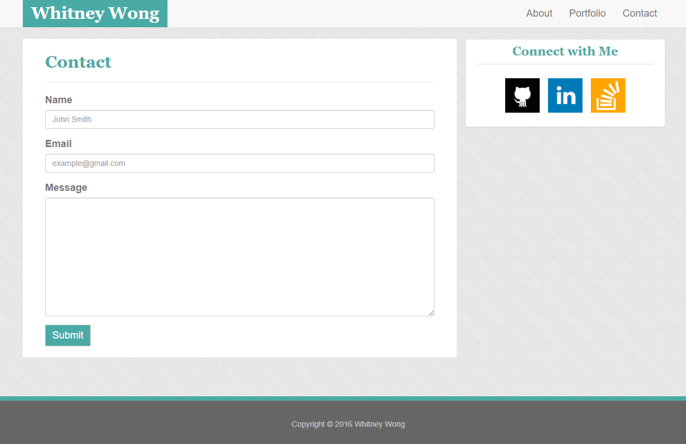
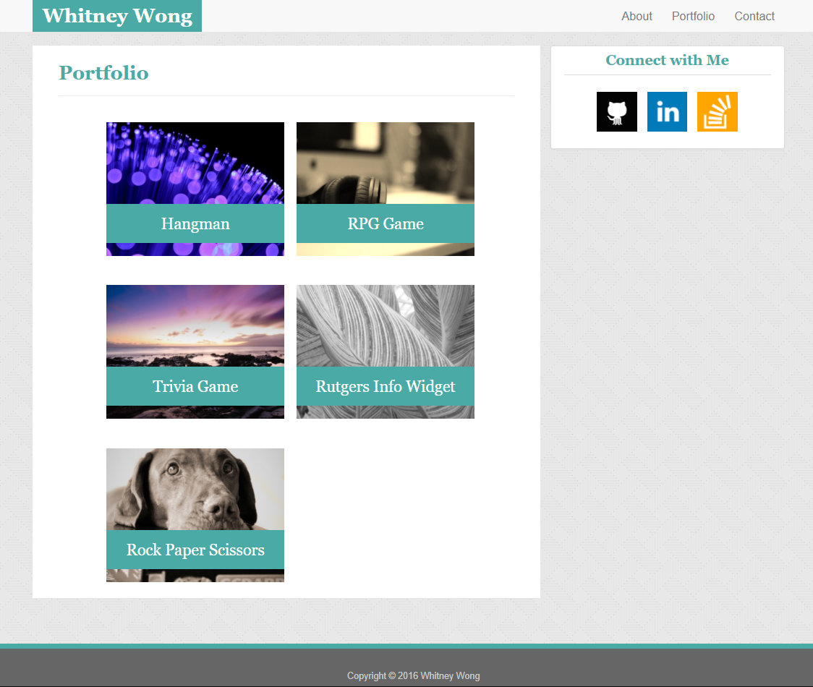

# Bootstrap-Portfolio
Created a portfolio using Bootstrap and a template to guide the look of each html page. This project contains an index.html, portfolio.html, and contact.html page.

Technology used to make this project: HTML, CSS, and Bootstrap.

Below are screenshots of each html page:
### Index

### Contact

### Portfolio
